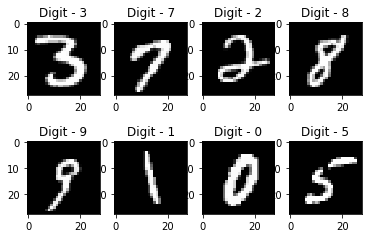

<h1>Project Title</h1>

Performing Analysis of Meteorological Data

Recognizing Handwritten Digits with scikit-learn

<h2>Introduction</h2>

In this repository, you will find two projects that I have worked on:

<ul>
  <li>Performing Analysis of Meteorological Data</li>
  <li>Recognizing Handwritten Digits with scikit-learn</li>
</ul>

Both projects are related to data analysis and machine learning. The first project involves analyzing meteorological data to gain insights into weather patterns and trends. The second project involves building a machine learning model to recognize handwritten digits using scikit-learn.

<h2>Project Details</h2>

<h3>Performing Analysis of Meteorological Data</h3>

The meteorological data analysis project involves analyzing data from a weather station to gain insights into weather patterns and trends. The project includes the following files:

<ul>
  <li><code>data.csv</code>: A CSV file containing the meteorological data.</li>
  <li><code>analysis.ipynb</code>: A Jupyter Notebook that contains the code for analyzing the data and generating visualizations.</li>
</ul>

Here are some of the visualizations generated by the project:

<h3>Recognizing Handwritten Digits with scikit-learn</h3>

The handwritten digit recognition project involves building a machine learning model to recognize handwritten digits using scikit-learn. The project includes the following files:

<ul>
  <li><code>digits.csv</code>: A CSV file containing images of handwritten digits.</li>
  <li><code>model.ipynb</code>: A Jupyter Notebook that contains the code for building the machine learning model and testing it.</li>
</ul>

Here are some examples of the handwritten digits recognized by the model:

<h2>Conclusion</h2>

Both projects demonstrate my skills in data analysis and machine learning. I hope you find them useful and informative.

Thank you for visiting my repository!

